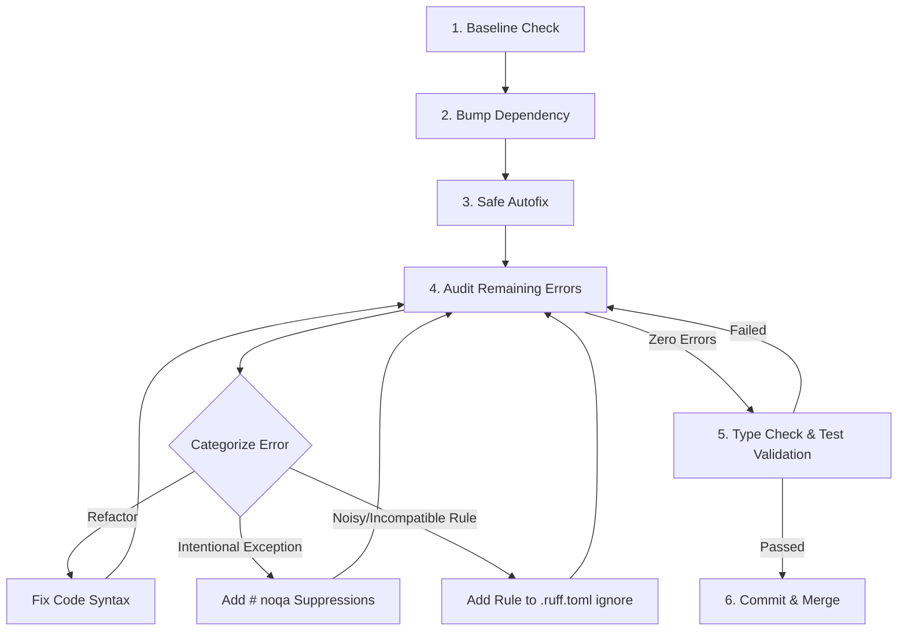

# Ruff Upgrade runbook

This skill provides a systematic workflow for upgrading the `ruff` lint and format tool in Python repositories. Version upgrades (especially minor/major version bumps, e.g. `0.15.x` -> `0.16.x`) often activate a large set of new rules by default, requiring code adaptation or configuration adjustments.

Follow this workflow to ensure clean, low-risk upgrades.

---

## The Ruff Upgrade Loop



### 1. Baseline Check
Ensure the repository's main branch is clean.
```bash
# Verify no unstaged changes
git status

# Run existing linter/test suite
./script/lint
./script/test
```

### 2. Bump Dependency
Update the Ruff version dependency:
* If pinned in `requirements_dev.txt`, update `ruff==<new_version>`.
* If defined in `pyproject.toml` or `uv.lock`, update the package dependency.
* Re-bootstrap the virtual environment:
  ```bash
  ./script/bootstrap
  ```

### 3. Safe Autofix
Run Ruff's built-in formatting and automatic error fixes to handle the majority of formatting changes and basic code transformations.
```bash
uv run ruff check --fix
uv run ruff format
```

### 4. Audit & Categorize Remaining Errors
Run a check without fixes to find issues that cannot be resolved automatically:
```bash
uv run ruff check --no-fix
```

For each remaining diagnostic, choose one of these three resolution paths:

#### Path A: Refactor Code (Preferred)
Modify the code to comply with the new rule if the change improves readability, type safety, or performance. Examples:
* **`SIM117`**: Consolidate nested `with` statements:
  ```python
  # Before
  with open("a") as f1:
      with open("b") as f2:
          ...
  # After
  with open("a") as f1, open("b") as f2:
      ...
  ```
* **`PIE810`**: Simplify `startswith` with tuple:
  ```python
  # Before
  if url.startswith("http://") or url.startswith("https://"):
  # After
  if url.startswith(("http://", "https://")):
  ```

#### Path B: Suppress locally with `# noqa`
For intentional violations that are valid in specific contexts (e.g. top-level exception catching in main scripts/CLIs), add an inline suppression:
```python
try:
    main()
except Exception as err:  # noqa: BLE001
    print_error(err)
```

#### Path C: Ignore rule globally in `.ruff.toml`
If a rule is too noisy, incompatible with runtime serialization libraries (like `mashumaro`), or unsupported by your static analysis suite (like name shadowing `list[...]` vs class method `list` in type checkers), add it to `ignore` in `.ruff.toml`:
```toml
[lint]
ignore = [
    "UP046",  # e.g., if PEP 695 generics are incompatible with typing toolchain
]
```

### 5. Type Check & Test Validation
Ensure the linter changes did not introduce static analysis failures or runtime regressions:
```bash
# Check static typing (e.g. ty, mypy)
uv run ty check .
# Run all unit tests
./script/test
```

### 6. Commit & Merge
Once `./script/lint` and `./script/test` both pass cleanly, commit the files and submit the PR.
